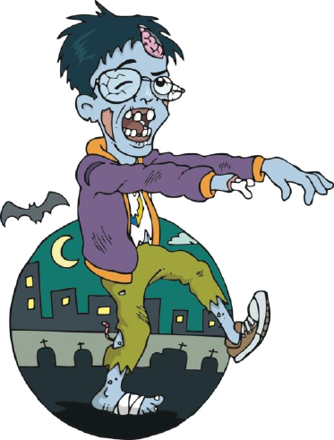

# Python para Zumbis

Projeto criado pelo professor Fernando Masanori, onde ele leciona aulas de lógica de programação envolvendo a linguagem Python. 
- Como práticas, há exercícios propostos organizados em listas, as quais podem ser encontradas neste repositório com algumas das várias formas de se resolver os mesmos problemas.